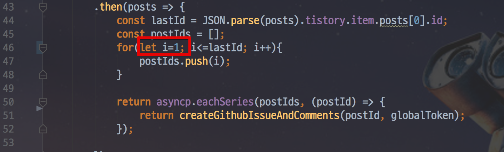

# 티스토리 댓글 마이그레이션 

[](https://travis-ci.org/jojoldu/comments-migration) [](https://coveralls.io/github/jojoldu/comments-migration?branch=master)

## 소개

티스토리의 기본 댓글을 [utteranc](https://utteranc.es/)로 마이그레이션 하는 스크립트


## 사용

clone 받은 디렉토리에 token.json 을 아래 형태로 생성
 
```json
{
  "tistory": {
    "blogName": "티스토리 블로그 네임",
    "token": "티스토리 OAuth 토큰"
  },
  "github": {
    "owner": "깃헙 유저네임",
    "repo": "깃헙 댓글(utteranc) 저장소",
    "token": "깃헙 OAuth 토큰"
  }
}
```


```bash
npm install
```

아래를 실행하면 순차적으로 실행된다.
```bash
npm run execute
```

## 주의사항

Github에선 Create API를 빠르게 많이 사용하면 (대략 2분에 100건 추측) API 사용 제한을 잠시 걸어둠  
아래와 같은 메세지가 보이면 1~2시간 뒤에 다시 실행해야함

```javascript
(node:24540) UnhandledPromiseRejectionWarning: Unhandled promise rejection (rejection id: 1): StatusCodeError: 403 - {"message":"You have triggered an abuse detection mechanism and have been temporarily blocked from content creation. Please retry your request again later.","documentation_url":"https://developer.github.com/v3/#abuse-rate-limits"}
```

아래위치의 ```let i=1```을 **가장 마지막에 실행된 postId로 교체해서 다시 실행**한다.

